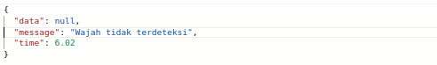
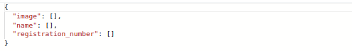
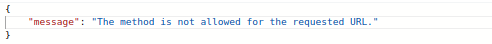

# Project Summary
Project Name : **Face Verification Approval - Face Recognition**
<br>
Algorithm : **[face-recognition](https://github.com/ageitgey/face_recognition) from ageitgey**
<br>
Current Model : **dlib**
<br>

# Quickstart
Clone this repository, then install package requirements.
```bash
$ git clone http://gitlab.quick.com/artificial-intelligence/face-verification-for-approval-kasie.git
$ cd face-verification-for-approval-kasie
$ pip install -r requirements.txt
```
<br>

# Dataset
We try with messi and ronaldo photo. Both photos will be extracted and stored into json file. <br>


<br>

# Face Verification

### Overview
**API Face Verification** have 4 main function :
- Realtime face verification
- Registration for new user
- Update user data
- Delete user data

<br>

# <div align="left"><h3>API Documentation</h3></div>

# Endpoints

- ##  Perform Face Recognition
    This endpoint is used to perform facial recognition on input images. The method used is **`POST`**.
    <br>

    - **Endpoint**
        ```bash
        POST   /face-recognition/predict
        ```
        **Request Body** `(form-data)` :
        * **`image`** _(file, required)_ : facial images as input for prediction.

    <br>

    - **Example Request using CURL**
        ```bash
        curl --request POST 'http://localhost:5000/face-recognition/predict' \
            --header 'Host: localhost' \
            --header 'Content-Type: multipart/form-data' \
            --form 'image=@"/path/To/yourFolder/Image.jpeg"' \
        ```

    <br>

    - **Successful Response**
        ```json
        {
            "data": {
                "name": "",
                "registration_number": ""
            },
            "message": "Success detecting face",
            "time": 4.44
        }
        ```
    <br>

-  ##  Register a New Face with Associated Data
    This endpoint is used to register new user faces and related user data. The method used is **`POST`**.

    - **Endpoint**
        ```bash
        POST   /face-recognition/registration
        ```

        **Request Body** `(form-data)` :
        * **`no_ind`** _(string, required)_ : user id string.
        * **`image`** _(file, required)_ : face image user.

    <br>

    - **Example Request using CURL**
        ```bash
        curl --request POST 'http://localhost:5000/face-recognition/registration' \
            --header 'Host: localhost' \
            --header 'Content-Type: multipart/form-data' \
            --form 'no_ind="{no_ind}"'\
            --form 'image=@"/path/To/yourFolder/Image.jpeg"'
        ```
    <br>

    - **Successful Response**
        ```json
        {
            "image": "http://localhost/face-verification/images-registered/{no_ind+name}.JPG",
            "name": "{name}",
            "registration_number": "{no_ind}"
        }   
        ```
    <br>


- ##  Get Sorted User Data
    This endpoint is used to retrieve user data that has been successfully registered, in sequence. The method used is **`GET`**.
    <br>

    - **Endpoint**
        ```bash
        GET  /face-recognition/data-face
        ```
    <br>

    - **Example Request using CURL**
        ```bash
        curl --request GET 'http://localhost:5000/face-recognition/data-face' \
            --header 'Host: localhost' 
        ```
    <br>

    - **Successful Response**
        ```json
        {
            "data": [
                {
                "image": "http://localhost/face-verification/images-registered/Messi.JPG",
                "name": "MESSI",
                "registration_number": "001"
                },
                {
                "image": "http://localhost/face-verification/images-registered/Ronaldo.JPG",
                "name": "RONALDO",
                "registration_number": "002"
                },
                 ....
            ]
        }
        ```
    <br>


-  ##  Update Spesific User's Name
    This endpoint is used to update the user name based on the user ID number entered. The method used is **`PUT`**.

    - **Endpoint**
        ```
        PUT   /face-recognition/update-name
        ```

        **Request Body** `(form-data)` :
        * **`no_ind`** _(string, required)_ : string of registered user id number.
        * **`new_name`** _(string, required)_ : new user name string.

    <br>

    - **Example Request using CURL**
        ```bash
        curl --request PUT 'http://localhost/face-recognition/update-name' \
            --header 'Host: localhost' \
            --header 'Content-Type: multipart/form-data' \
            --form 'no_ind="{no_ind}"'\
            --form 'new_name="{new_name}"'
        ```
    <br>

    - **Successful Response**
        ```json
        {
            "success": true
        }
        ```
    <br>


- ##  Update Spesific User's ID (Nomor Induk)
    This endpoint is used to update a user's id number data. The method used is **`PUT`**.

    - **Endpoint**
        ```
        PUT   /face-recognition/update-noind
        ```
        **Request Body** `(form-data)` :
        * **`no_ind`** _(string, required)_ : string of registered user id number.
        * **`new_noid`** _(string, required)_ : new master number string.

    <br>

    - **Example Request using CURL**
        ```bash
        curl --request PUT 'http://localhost/face-recognition/update-noind' \
            --header 'Host: localhost' \
            --header 'Content-Type: multipart/form-data' \
            --form 'no_ind="{no_ind}"'\
            --form 'new_noid="{new_noid}"'
        ```
    <br>

    - **Successful Response**
        ```json
        {
            "success": true
        }
        ```
    <br>


- ##  Update Spesific User's Face Encoding
    This endpoint is used to update the facial feature encoding data of a user with a specific master number. The method used is **`PUT`**.

    - **Endpoint**
        ```
        PUT   /face-recognition/update-face
        ```

        **Request Body** `(form-data)` :
        * **`no_ind`** _(string, required)_ : User id string.
        * **`image`** _(file, required)_ : a new image file containing the associated user's face..

    <br>
    
    - **Example Request using CURL**
        ```bash
        curl --request PUT 'http://localhost/face-recognition/update-face' \
            --header 'Host: localhost' \
            --header 'Content-Type: multipart/form-data' \
            --form 'no_ind="{no_ind}"'\
            --form 'image=@"/path/To/yourFolder/Image.jpeg"' 

        ```
    <br>

    - **Successful Response**
        ```json
        {
            "success": true
        }
        ```
    <br>


- ##  Delete Spesific User's Data

    This endpoint is used to delete a user's data based on the master number entered. The method used is **`DELETE`**.

    - **Endpoint**
        ```
        DELETE   /face-recognition/delete-data
        ```
        **Request Body** `(form-data)` :
        * **`no_ind`** _(string, required)_ : string of user ID number whose data record will be deleted.

    <br>
    
    - **Example Request using CURL**
        ```bash
        curl --request DELETE 'http://localhost/face-recognition/delete-data' \
            --header 'Host: localhost' \
            --header 'Content-Type: multipart/form-data' \
            --form 'no_ind="{no_ind}"'
        ```
    <br>

    - **Successful Response**
        ```json
        {
            "success": true
        }
        ```
    <br>

# Error Handling (Client-Side)
Client-side error means when a request from the client cannot be understood or processed by the server due to an error on the client side that made the request. Here are some examples of *client-side errors* that may occur when making a request to the Face Verification API.

- **404 _notfound_** on the endpoints used to update user data. 
    <br>
    This error can occur when the server cannot find the master number data that is the user's request. The error message in the image above is usually found on the following endpoints:
    - `/face-recognition/update-name`
    - `/face-recognition/update-face`
    - `/face-recognition/update-noind`
    - `/face-recognition/delete-data`
    
    <br>

    **Error Handling**:
    - Check if there are format errors in the parameter body or typos in the entered values.
    - Check whether the user's personal data has been registered correctly. [link](http://ai.quick.com/face-verification/images-registered/) here.

<br>


- **404 _notfound_** on endpoint `/face-recognition/predict`.<br>
    <br>
    The error in the image above occurs when :
    - The input image does not display a clear facial figure, or
    - The server did not find a face encoding in the database, which is similar to the input image
   
   <br>

    **Error Handling**:
    - Double check the input image, make sure the face is clearly visible.
    - Register if you haven't already so that your personal data and facial encoding are stored in the database.

<br>

- **400 _bad request_** on endpoint `/face-recognition/registration`
    <br>
    The image above is an example of a bad request, namely when the value entered by the user is empty. `(value = "")`. <br>

    **Error Handling**:
    - Make sure to enter the values ​​correctly.

<br>

- **405 _method not allowed_**

    <br>
    The above error message will be found when the request method used is not permitted to access the URL. 
    <br>

    **Error Handling**:
    - Use the appropriate request method. Double-check the documentation regarding using the Face Verification API endpoint.
