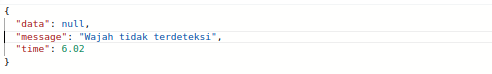
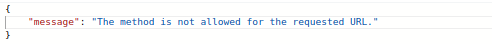

# Face Verification

### Overview
**API Face Verification** memiliki beberapa fungsi yang berkaitan dengan pengenalan wajah, diantaranya :
- verifikasi wajah secara real-time;
- registrasi data dan wajah user baru;
- pembaruan data user; dan
- menghapus data user.

<br>

# <div align="left"><h3>API Documentation</h3></div>

# Base URL

```bash
http://ai.quick.com
```
Seluruh jenis request menuju server AI menggunakan base URL tersebut.

<br>

# Endpoints

- ##  Perform Face Recognition
    Endpoint ini digunakan untuk melakukan pengenalan wajah pada gambar input. Metode yang digunakan adalah **`POST`**.
    <br>

    - **Endpoint**
        ```bash
        POST   /face-recognition/predict
        ```
        **Request Body** `(form-data)` :
        * **`image`** _(file, required)_ : gambar wajah sebagai input untuk prediksi.

    <br>

    - **Example Request using CURL**
        ```bash
        curl --request POST 'http://ai.quick.com/face-recognition/predict' \
            --header 'Host: ai.quick.com' \
            --header 'Content-Type: multipart/form-data' \
            --form 'image=@"/path/To/yourFolder/Image.jpeg"' \
        ```

    <br>

    - **Successful Response**
        ```json
        {
            "data": {
                "name": "",
                "registration_number": ""
            },
            "message": "Success detecting face",
            "time": 4.44
        }
        ```
    <br>

-  ##  Register a New Face with Associated Data
    Endpoint ini digunakan untuk mendaftarkan wajah user baru beserta data user terkait. Metode yang digunakan adalah **`POST`**.

    - **Endpoint**
        ```bash
        POST   /face-recognition/registration
        ```

        **Request Body** `(form-data)` :
        * **`no_ind`** _(string, required)_ : string nomor induk user.
        * **`image`** _(file, required)_ : gambar wajah user.

    <br>

    - **Example Request using CURL**
        ```bash
        curl --request POST 'http://ai.quick.com/face-recognition/registration' \
            --header 'Host: ai.quick.com' \
            --header 'Content-Type: multipart/form-data' \
            --form 'no_ind="{no_ind}"'\
            --form 'image=@"/path/To/yourFolder/Image.jpeg"'
        ```
    <br>

    - **Successful Response**
        ```json
        {
            "image": "http://192.168.168.195/face-verification/images-registered/{no_ind+name}.JPG",
            "name": "{name}",
            "registration_number": "{no_ind}"
        }   
        ```
    <br>


- ##  Get Sorted User Data
    Endpoint ini digunakan untuk mengambil data user yang telah berhasil terdaftar, secara urut. Method yang digunakan adalah **`GET`**.
    <br>

    - **Endpoint**
        ```bash
        GET  /face-recognition/data-face
        ```
    <br>

    - **Example Request using CURL**
        ```bash
        curl --request GET 'http://ai.quick.com/face-recognition/data-face' \
            --header 'Host: ai.quick.com' 
        ```
    <br>

    - **Successful Response**
        ```json
        {
            "data": [
                {
                "image": "http://192.168.168.195/face-verification/images-registered/A1921 ISTANTO.JPG",
                "name": "ISTANTO",
                "registration_number": "A1921"
                },
                {
                "image": "http://192.168.168.195/face-verification/images-registered/A2203 SUPARI.JPG",
                "name": "SUPARI",
                "registration_number": "A2203"
                },
                {
                "image": "http://192.168.168.195/face-verification/images-registered/B0325 JUNAWI RAHARJO.JPG",
                "name": "JUNAWI RAHARJO",
                "registration_number": "B0325"
                },  
                
                 ....
            ]
        }
        ```
    <br>


-  ##  Update Spesific User's Name
    Endpoint ini digunakan untuk memperbarui nama user berdasarkan nomor induk yang diinput. Metode yang digunakan adalah **`PUT`**.

    - **Endpoint**
        ```
        PUT   /face-recognition/update-name
        ```

        **Request Body** `(form-data)` :
        * **`no_ind`** _(string, required)_ : string nomor induk user yang terdaftar.
        * **`new_name`** _(string, required)_ : string nama baru user.

    <br>

    - **Example Request using CURL**
        ```bash
        curl --request PUT 'http://ai.quick.com/face-recognition/update-name' \
            --header 'Host: ai.quick.com' \
            --header 'Content-Type: multipart/form-data' \
            --form 'no_ind="{no_ind}"'\
            --form 'new_name="{new_name}"'
        ```
    <br>

    - **Successful Response**
        ```json
        {
            "success": true
        }
        ```
    <br>


- ##  Update Spesific User's ID (Nomor Induk)
    Endpoint ini digunakan untuk memperbarui data nomor induk seorang user. Metode yang digunakan adalah **`PUT`**.

    - **Endpoint**
        ```
        PUT   /face-recognition/update-noind
        ```
        **Request Body** `(form-data)` :
        * **`no_ind`** _(string, required)_ : string nomor induk user yang terdaftar.
        * **`new_noid`** _(string, required)_ : string nomor induk baru.

    <br>

    - **Example Request using CURL**
        ```bash
        curl --request PUT 'http://ai.quick.com/face-recognition/update-noind' \
            --header 'Host: ai.quick.com' \
            --header 'Content-Type: multipart/form-data' \
            --form 'no_ind="{no_ind}"'\
            --form 'new_noid="{new_noid}"'
        ```
    <br>

    - **Successful Response**
        ```json
        {
            "success": true
        }
        ```
    <br>


- ##  Update Spesific User's Face Encoding
    Endpoint ini digunakan untuk memperbarui data enkoding fitur wajah seorang user dengan nomor induk tertentu. Metode yang digunakan adalah **`PUT`**.

    - **Endpoint**
        ```
        PUT   /face-recognition/update-face
        ```

        **Request Body** `(form-data)` :
        * **`no_ind`** _(string, required)_ : string nomor induk user.
        * **`image`** _(file, required)_ : file gambar baru yang berisi wajah user terkait.

    <br>
    
    - **Example Request using CURL**
        ```bash
        curl --request PUT 'http://ai.quick.com/face-recognition/update-face' \
            --header 'Host: ai.quick.com' \
            --header 'Content-Type: multipart/form-data' \
            --form 'no_ind="{no_ind}"'\
            --form 'image=@"/path/To/yourFolder/Image.jpeg"' 

        ```
    <br>

    - **Successful Response**
        ```json
        {
            "success": true
        }
        ```
    <br>


- ##  Delete Spesific User's Data

    Endpoint ini digunakan untuk menghapus data seorang user berdasarkan nomor induk yang diinput. Metode yang digunakan adalah **`DELETE`**.

    - **Endpoint**
        ```
        DELETE   /face-recognition/delete-data
        ```
        **Request Body** `(form-data)` :
        * **`no_ind`** _(string, required)_ : string nomor induk user yang akan dihapus record datanya.

    <br>
    
    - **Example Request using CURL**
        ```bash
        curl --request DELETE 'http://ai.quick.com/face-recognition/delete-data' \
            --header 'Host: ai.quick.com' \
            --header 'Content-Type: multipart/form-data' \
            --form 'no_ind="{no_ind}"'
        ```
    <br>

    - **Successful Response**
        ```json
        {
            "success": true
        }
        ```
    <br>

# Error Handling (Client-Side)
Error dari sisi klien berarti ketika request dari klien tidak dapat dipahami atau diproses oleh server karena adanya kesalahan pada sisi klien yang melakukan permintaan. Berikut beberapa contoh *client-side error* yang mungkin terjadi pada saat melakukan request ke Face Verification API.

- **404 _notfound_** pada endpoint-endpoint yang digunakan untuk melaukan update data user. 
    <br>
    Error tersebut dapat terjadi ketika server tidak dapat menemukan data nomor induk yang menjadi request user. Error message pada gambar di atas biasa ditemukan pada endpoint berikut :
    - `/face-recognition/update-name`
    - `/face-recognition/update-face`
    - `/face-recognition/update-noind`
    - `/face-recognition/delete-data`
    
    <br>

    **Error Handling**:
    - Periksa apabila ada kesalahan format pada body parameter atau typo pada value yang dimasukkan.
    - Periksa apakah data diri user telah terdaftarkan dengan benar pada [link](http://ai.quick.com/face-verification/images-registered/) berikut.

<br>


- **404 _notfound_** pada endpoint `/face-recognition/predict`.<br>
    <br>
    Error pada gambar di atas terjadi ketika :
    - gambar yang menjadi masukan tidak menampilkan figur wajah dengan jelas, atau
    - server tidak menemukan face encoding dalam database, yang serupa dengan gambar masukan
   
   <br>

    **Error Handling**:
    - Periksa ulang gambar masukkan, pastikan wajah tampak jelas.
    - Lakukan registrasi apabila belum agar data diri dan enkoding wajah tersimpan dalam database.

<br>

- **400 _bad request_** pada endpoint `/face-recognition/registration`
    <br>
    Gambar di atas merupakan salah satu contoh bad request, yaitu ketika value yang dimasukkan user bernilai kosong `(value = "")`. <br>

    **Error Handling**:
    - Pastikan memasukkan value dengan benar.

<br>

- **405 _method not allowed_**

    <br>
    Pesan error di atas akan ditemukan ketika metode request yang digunakan tidak diizinkan untuk mengakses URL. 
    <br>

    **Error Handling**:
    - Gunakan metode request yang sesuai. Periksa kembali dokumentasi mengenai penggunaan endpoint Face Verification API.
